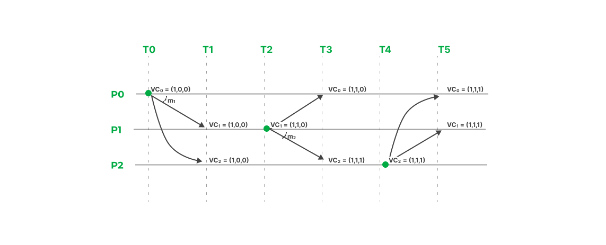
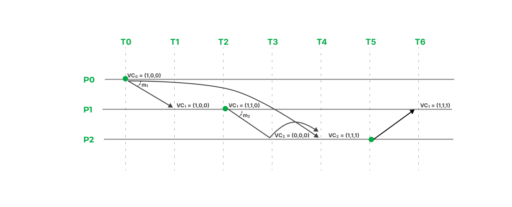
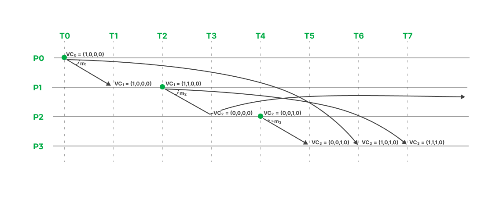

# Relógios Lógicos de Lamport com MPI

## Descrição

Este projeto implementa o algoritmo de relógio de Lamport para sincronização de relógios lógicos com comunicação causal utilizando MPI (Message Passing Interface) e a biblioteca mpi4py em Python. Este exemplo é útil para entender como funciona a sincronização de eventos em sistemas distribuídos.

## Estrutura do Projeto

```bash
lamport-clock/
├── index.py
├── README.md
├── requirements.txt
└── utils/
    ├── config.py
    └── printer.py
```

-   `index.py`: Arquivo principal que inicializa os processos MPI, define a configuração de mensagens a serem enviadas, e sincroniza os processos.
-   `process.py`: Define a classe `Process` que gerencia o relógio lógico, o envio e recebimento de mensagens, e a lógica de atraso.
-   `utils/config.py`: Configurações de terminal para garantir a exibição correta dos caracteres.
-   `utils/printer.py`: Funções utilitárias para exibir mensagens coloridas no console.
-   `requirements.txt:` Arquivo com as dependências do projeto.

## Pré-requisitos

Para rodar este projeto, você precisará ter o seguinte software instalado:

-   Python 3.6 ou superior
-   MPI (MPICH no Linux ou MS-MPI no Windows)
-   Biblioteca mpi4py (Instalada no ambiente virtual)

## Instalação

### Instalação no Windows

**Passo 1: Instalar o MS-MPI**

1. Baixe e instale o MS-MPI Runtime e o MS-MPI SDK a partir do [site da Microsoft](https://docs.microsoft.com/en-us/message-passing-interface/microsoft-mpi).
2. Adicione os caminhos `C:\Program Files\Microsoft MPI\Bin` e `C:\Program Files (x86)\Microsoft SDKs\MPI\Include` à variável de ambiente PATH.

**Passo 2: Configurar o ambiente virtual**

1. Crie um ambiente virtual com o Python 3.6 ou superior:

```bash
python -m venv venv
```

2. Ative o ambiente virtual e instale as dependências do projeto:

```bash
./venv/Scripts/activate

pip install -r requirements.txt
```

### Instalação no Linux

**Passo 1: Instalar o MPICH**

Abra o terminal e execute o seguinte comando para instalar o MPICH:

```bash
sudo apt-get update
sudo apt-get install -y mpich
```

**Passo 2: Configurar o ambiente virtual**

1. Crie um ambiente virtual com o Python 3.6 ou superior:

```bash
python -m venv venv
```

2. Ative o ambiente virtual e instale as dependências do projeto:

```bash
source venv/bin/activate

pip install -r requirements.txt
```

## Execução

1. Clone este repositório ou baixe os arquivos para o seu computador.
2. Navegue até o diretório onde o arquivo `index.py` está salvo.
3. Execute o script utilizando `mpiexec` ou `mpirun`:

```bash
mpiexec -n 4 python lamport_clock.py
```

Substitua o número `4` pelo número de processos que deseja executar.

## Exemplos:

### 1. Exemplo: 3 Processos com multicast

```py
messages = [
    {"source": 0, "time": 0, "receivers": []},
    {"source": 1, "time": 2, "receivers": []},
    {"source": 2, "time": 4, "receivers": []},
]
```



### 2. Exemplo: 3 Processos sem atraso

```py
messages = [
    {"source": 0, "time": 0, "receivers": [{"p": 1}, {"p": 2, "delay": 4}]},
    {"source": 1, "time": 2, "receivers": [{"p": 2}]},
    {"source": 2, "time": 4, "receivers": [{"p": 1}]},
]
```



### 3. Exemplo: 4 Processos com atraso (Exercício do slide)

```py
messages = [
    {"source": 0, "time": 0, "receivers": [{"p": 1}, {"p": 3, "delay": 6}]},
    {"source": 1, "time": 2, "receivers": [{"p": 2}, {"p": 3, "delay": 5}]},
    {"source": 2, "time": 4, "receivers": [{"p": 3}]},
]
```


